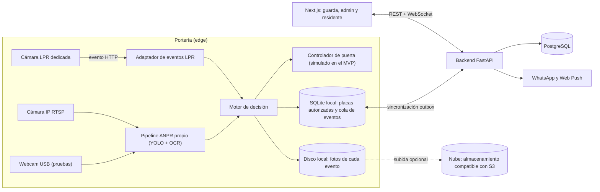

# Plan: sistema de portería con reconocimiento de placas

Sistema para porterías de conjuntos residenciales (Colombia) que detecta las placas de los vehículos, abre la puerta a quien está autorizado y deja registro de ingresos y salidas. Incluye una interfaz web para registrar visitantes, gestionar preautorizaciones y consultar la bitácora.

Es un proyecto para aprender, así que cada paso se documenta y se explica (ver [Forma de trabajo](#forma-de-trabajo-proyecto-de-aprendizaje)).

## Decisiones iniciales

| Tema | Decisión |
|---|---|
| Ejecución del reconocimiento | En sitio (edge), con sincronización a la nube |
| Alcance | Un solo conjunto |
| Cámaras | Webcam USB para las pruebas iniciales; en producción, cámaras IP genéricas por RTSP y cámaras LPR dedicadas |
| Puerta | Simulada en el MVP. En producción, el sistema se conecta en paralelo al mando existente: la puerta sigue funcionando con su control remoto y su pulsador manual |
| Imágenes | Siempre se guardan en local; la subida a la nube es opcional y se activa por configuración |
| Stack | Python (FastAPI, YOLO, OCR), Next.js, PostgreSQL |
| Propósito | Proyecto de aprendizaje: todo lo que se hace se explica |
| MVP | Placas y apertura automática, bitácora con foto, visitantes, preautorizaciones, notificaciones y reportes |

## Resumen

En cada portería habrá un equipo local (un mini-PC) que lee las placas, decide si abre y acciona la puerta. Ese equipo sigue funcionando aunque se caiga internet. Un backend central guarda la bitácora, los residentes, los visitantes y las preautorizaciones, y lo alimenta una interfaz web con tres vistas: el guarda, la administración y el residente.

## Arquitectura



Las decisiones de diseño más importantes:

- **Todas las fuentes de video se manejan con un mismo contrato.** Todas producen un evento `PlateRead` con placa, confianza, foto, carril y hora. La webcam y la cámara IP pasan por el pipeline propio y la cámara LPR por un adaptador de su API (ISAPI en Hikvision, push HTTP en Dahua). Después de ese punto, el resto del sistema no sabe de qué cámara viene la lectura.
- **La captura se abstrae detrás de una interfaz `FrameSource`.** Hay tres implementaciones: `WebcamSource` (dispositivo USB por índice, por ejemplo `0`), `RtspSource` (URL de la cámara IP) y `VideoFileSource` (videos grabados para pruebas repetibles). Cambiar de webcam a cámara IP es solo un cambio de configuración del carril.
- **La puerta se maneja detrás de una interfaz `GateController`.** En el MVP la implementación es `SimulatedGate`, que solo muestra el estado en la interfaz. Luego se agrega un `RelayGate` (ESP32 o relé por Ethernet) o un adaptador ZKTeco sin tocar el resto.
- **El sistema convive con los mandos que ya tiene la puerta.** El relé se conecta en paralelo a la entrada de apertura (contacto seco o pulsador) de la tarjeta del motor, así que el control remoto y el pulsador manual siguen funcionando igual. El sistema solo envía un pulso de apertura y nunca bloquea ni reemplaza los mandos existentes. Si el equipo local falla o se apaga, la puerta sigue operando como antes.
- **Las aperturas por control remoto o pulsador también quedan registradas.** Un sensor de estado de la puerta (final de carrera o sensor magnético) leído por el mismo módulo del relé detecta cada apertura. Si la puerta se abre sin que el sistema la haya ordenado, se registra como apertura externa y se asocia con la placa que lea la cámara en ese momento, si la hay.
- **El equipo local funciona sin internet.** Cada portería guarda una copia local de las placas y preautorizaciones vigentes. Las aperturas se deciden ahí mismo, en menos de 1,5 s, y los eventos se encolan y se sincronizan cuando vuelve la conexión.
- **Las imágenes se guardan siempre en local y la subida a la nube es opcional.** Se manejan detrás de una interfaz `ImageStore`. `LocalImageStore` guarda cada foto en el disco del equipo local, organizada por fecha (por ejemplo `data/images/2026/10/04/<evento>.jpg`). `CloudImageStore` sube una copia a un almacenamiento compatible con S3 solo si está activado en la configuración (`IMAGES_CLOUD_UPLOAD=true`). La subida va por la misma cola de sincronización, así que no frena la apertura de la puerta y se reintenta si no hay internet. La base de datos guarda la ruta local de cada foto y, si se subió, su ubicación en la nube.
- **La dirección (ingreso o salida) viene del carril.** Cada cámara se configura como de entrada o de salida, en vez de inferir la dirección desde la imagen.

## Pipeline de visión (webcam y cámaras IP)

1. **Captura:** OpenCV desde la webcam, un archivo de video o RTSP (OpenCV o GStreamer), con detección de movimiento o una zona de interés para no procesar todos los cuadros.
2. **Detección de la placa:** YOLO (v8 o v11) ajustado con placas colombianas de carro y de moto.
3. **Seguimiento:** ByteTrack, para agrupar varios cuadros del mismo vehículo.
4. **OCR:** PaddleOCR o `fast-plate-ocr` sobre la placa recortada.
5. **Validación del formato colombiano:** `^[A-Z]{3}\d{3}$` para carros y `^[A-Z]{3}\d{2}[A-Z]$` para motos, con corrección de caracteres que se confunden según la posición (O y 0, I y 1, B y 8).
6. **Votación entre cuadros:** se emite la placa solo cuando hay consenso entre varias lecturas y supera un umbral de confianza.

## Motor de decisión

| Situación | Acción |
|---|---|
| Placa de residente activo | Abre y registra |
| Preautorización vigente | Abre, registra y notifica al residente |
| Placa desconocida | No abre; alerta al guarda con foto para que registre al visitante |
| Confianza baja o coincidencia parcial | No abre; el guarda confirma con un clic |
| Placa bloqueada o reportada | No abre y genera una alerta |
| Salida | Abre según la política del conjunto; cierra la visita abierta |
| Apertura por control remoto o pulsador manual | No interviene; registra la apertura como externa con la placa leída (si la hay) y la foto |

Por seguridad, nunca se abre automáticamente con coincidencias aproximadas. Esas lecturas siempre pasan por el guarda.

## Modelo de datos (núcleo)

- **Infraestructura:** `Torre`, `Unidad`, `Porteria`, `Carril` (dirección y tipo de cámara), `Camara`, `Puerta`.
- **Personas:** `Residente` (asociado a una unidad), `Vehiculo` (placa, tipo, unidad, estado), `Visitante` (documento, nombre, foto opcional).
- **Accesos:**
  - `Preautorizacion`: unidad, visitante o placa, ventana de vigencia, código QR o enlace, número de usos.
  - `EventoAcceso`: lectura, confianza, foto, carril, decisión, motivo, operador, origen de la apertura (sistema, consola del guarda, control remoto o pulsador) y hora.
  - `Visita`: ingreso y salida emparejados, con su tiempo de permanencia.
- **Seguridad:** `Usuario` con roles (admin, guarda, residente) y `Auditoria` de las acciones manuales, como aperturas forzadas y ediciones.

## Interfaz web (Next.js)

- **Consola del guarda:** muestra en tiempo real las lecturas con su foto (por WebSocket) y tiene botones de abrir y rechazar. Permite registrar un visitante rápido (placa, documento y unidad de destino) y consultar la bitácora del turno.
- **Panel de administración:** gestión de residentes, vehículos, unidades, cámaras y usuarios; la bitácora con filtros y exportación; y reportes de flujo por hora, visitantes frecuentes, vehículos que siguen dentro y lecturas fallidas.
- **Portal del residente:** permite crear preautorizaciones y compartir el enlace o QR con el visitante, ver el historial de su unidad y recibir notificaciones.

## Estructura del repositorio

```text
licenseRecognition/
├── apps/web/              # Next.js
├── services/api/          # FastAPI + PostgreSQL (SQLAlchemy + Alembic)
├── services/edge-agent/   # captura, ANPR, adaptadores LPR, decisión, puerta, sincronización
├── packages/contracts/    # contratos compartidos entre servicios, como PlateRead (ADR 0004)
├── ml/                    # datasets, entrenamiento y evaluación de YOLO y OCR
├── infra/                 # docker compose: hoy PostgreSQL y Adminer (ADR 0005); luego API, web, edge y almacenamiento compatible con S3 opcional
└── docs/                  # arquitectura, decisiones (ADRs), privacidad
```

## Forma de trabajo: proyecto de aprendizaje

El objetivo es entender cada pieza, no solo que funcione. Por eso:

- **Antes de cada paso** se explica qué se va a hacer, por qué y qué alternativas había.
- **Después de cada paso** se explica qué se hizo, cómo funciona y cómo probarlo.
- **Conceptos nuevos** (por ejemplo YOLO, OCR, RTSP, outbox, WebSocket) se explican la primera vez que aparecen, con un ejemplo concreto del proyecto.
- **Decisiones importantes** quedan escritas en `docs/decisiones/` como ADRs (un archivo corto por decisión: contexto, opciones, decisión y consecuencias).
- **Cada servicio** tiene un `README.md` que explica qué hace, cómo se ejecuta y cómo se prueba.
- **Los commits** son pequeños y con mensajes descriptivos, para poder seguir la historia del proyecto paso a paso.

## Fases

1. **Fase 0, base (alrededor de 1 semana):** monorepo, docker-compose, esquema de la base de datos, autenticación y roles, y el contrato `PlateRead`. Se hace en pasos pequeños, cada uno con su commit:
   - [x] Paso 1: esqueleto del monorepo, git y convenciones (ADR [0001](decisiones/0001-monorepo.md) y [0002](decisiones/0002-herramientas-uv-pnpm.md)).
   - [x] Paso 2: contrato `PlateRead` con sus pruebas.
   - [x] Paso 3: docker compose con PostgreSQL 18 y Adminer opcional, más la prueba de humo `infra/scripts/smoke.sh` (ADR [0005](decisiones/0005-infraestructura-local-docker-compose.md); requiere Docker Desktop).
   - [ ] Paso 4: API FastAPI con el esquema de la base de datos (SQLAlchemy y Alembic).
   - [ ] Paso 5: autenticación y roles (admin, guarda y residente).
2. **Fase 1, ANPR (2 a 3 semanas):** primero un prototipo con la webcam (placas impresas o fotos en pantalla, luego vehículos reales) para validar el pipeline de punta a punta. Después, reunir un dataset de placas colombianas, ajustar YOLO, montar el pipeline de OCR y validación, y armar un banco de pruebas con videos grabados. Las metas son al menos 95 % de exactitud por placa de día y menos de 1,5 s de latencia.
3. **Fase 2, equipo local y decisión (alrededor de 2 semanas):** motor de decisión, `SimulatedGate`, caché local, outbox de sincronización y el adaptador para la cámara LPR.
4. **Fase 3, portería (alrededor de 2 semanas):** consola del guarda en tiempo real, registro de visitantes y bitácora.
5. **Fase 4, residentes (alrededor de 2 semanas):** preautorizaciones con QR o enlace, notificaciones por WhatsApp Cloud API y Web Push.
6. **Fase 5, administración y endurecimiento (alrededor de 2 semanas):** reportes, auditoría, retención de datos y pruebas en sitio de noche y con lluvia.
7. **Fase 6, hardware:** reemplazar la puerta simulada por el relé conectado en paralelo a la entrada de apertura del motor, más el sensor de estado de la puerta. Verificar que el control remoto y el pulsador manual sigan funcionando, y que se conserve la seguridad propia del motor (fotoceldas que impiden cerrar sobre un vehículo).

## Riesgos a tener en cuenta

- **Condiciones reales de captura:** la noche (hace falta una cámara con infrarrojo), los reflejos, las placas sucias y las motos, que solo tienen placa trasera. Las cámaras deben ubicarse según el carril.
- **Protección de datos:** en Colombia aplica la Ley 1581 de 2012 (habeas data). Hace falta aviso de privacidad, autorización de los residentes, una política de retención de las fotos y control de acceso a la bitácora.
- **Espacio en disco del equipo local:** las fotos se acumulan. Hace falta una política de retención que borre las fotos locales con más de cierta antigüedad (por ejemplo 90 días) y, si la nube está activada, solo después de confirmar que se subieron.
- **Seguridad física:** la apertura forzada debe quedar auditada y nadie debe poder suplantar al equipo local ante el backend (se usarán credenciales por dispositivo). La operación manual ante fallas ya está cubierta porque el control remoto y el pulsador siguen funcionando.
- **Aperturas fuera del sistema:** los controles remotos de la puerta abren sin pasar por la validación de placas. Sin el sensor de estado, esas aperturas no quedarían en la bitácora. Con el sensor quedan registradas, pero no se sabe quién usó el control, solo la placa que haya leído la cámara.
- **Compatibilidad con el motor:** hay que confirmar la marca y el modelo de la tarjeta del motor y que tenga una entrada de apertura por contacto seco. Algunas tarjetas solo tienen una entrada "paso a paso" (abre, para, cierra), y en ese caso un pulso enviado con la puerta abierta podría cerrarla. Para evitarlo, el sistema consulta el sensor de estado antes de enviar el pulso.
- **Diferencia entre la webcam y las cámaras reales:** la webcam no tiene infrarrojo, zoom ni la resolución de una cámara de portería, así que los resultados en pruebas no garantizan los de producción. Las métricas finales deben medirse con la cámara definitiva instalada en el carril.
- **Dataset:** los modelos genéricos fallan con el formato colombiano, así que hay que grabar y etiquetar videos propios del conjunto.
